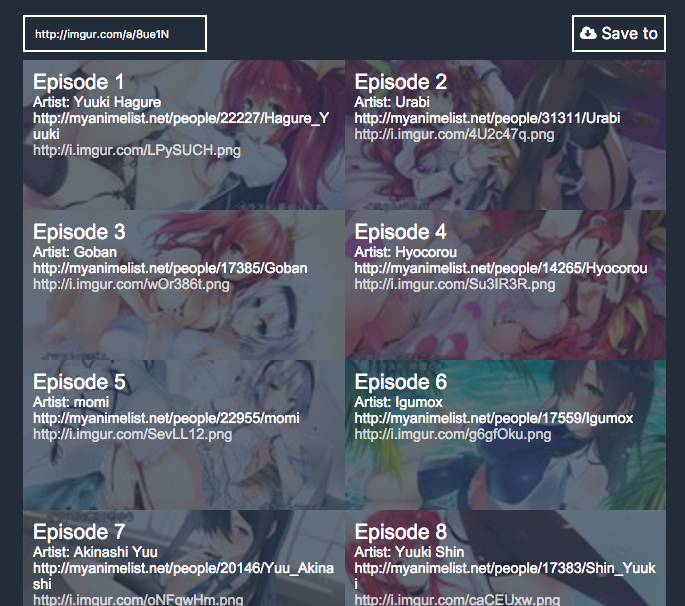

# Imgur Downloder

Imgur Download, by words, is a simple image downloader for [imgur.com](http://imgur.com).
It's not completed yet, but workable now. You can use it to batch download the whole album.

Special thanks to [electron-react-boilerplate](https://github.com/chentsulin/electron-react-boilerplate) a great boostrap boilerplate.

## Screenshot




1. Enter imgur album url and hit `enter`, and it show the preview.
2. Click save button for select save folder and then save it.

## Releases
[Download here](https://github.com/Yukaii/ImgurDownloader/releases)

## Install

Install dependencies.

```bash
npm install
```

## Run

Run this two commands __simultaneously__ in different console tabs.

```bash
npm run hot-server
npm run start-hot
```

*Note: requires a node version >= 4 and an npm version >= 2.*


## Package

```bash
npm run package
```

To package apps for all platforms:

```bash
npm run package-all
```

The rest of the development environment setup can be looked up from [electron-react-boilerplate](https://github.com/chentsulin/electron-react-boilerplate). I just change a bit of codes.
